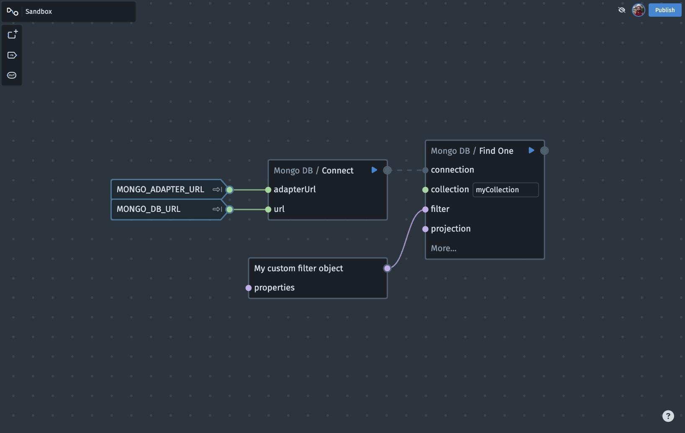

# NodeScript MongoDB Adapter

Facilitates MongoDB nodes in [NodeScript](https://nodescript.dev).

## Concepts

NodeScript is good at connecting services on the Internet. However, most databases like MongoDB are only available on internal cluster networks.

In order to communicate to MongoDB from NodeScript you need to deploy the adapter application to your cluster.

```mermaid
graph LR
    subgraph Cluster
        adapter[MongoDB Adapter] -- private network --> MongoDB
    end
    subgraph NodeScript Graph
        node[MongoDB Nodes] -- public internet --> adapter
    end
```

A single adapter application is able to connect to multiple different MongoDB databases, thus typically a single adapter deployment is required to facilitate connections to all databases you need.

NodeScript MongoDB Adapter is currently available as a docker image at `ghcr.io/nodescriptlang/adapter-mongodb`.

Example: `docker run -d -e AUTH_SECRET=<some_secret> -p 8080:8080 ghcr.io/nodescriptlang/adapter-mongodb`

## Configuration

NodeScript MongoDB Adapter can be configured with the following environment variables:

- **AUTH_SECRET** — authentication shared secret, used to restrict access from graphs to your adapter; graphs must include in `adapterUrl` field as follows: `https://<AUTH_SECRET>@<hostname>`

- **POOL_SIZE** (default: 5) - the maximum number of connections to establish to *each* database the adapter connects to.

- **POOL_TTL_MS** (default: 60_00) - pools created that many millis ago will be recycled (this eliminates connection leaks otherwise occurring with high-throughput scenarios)

- **CONNECT_TIMEOUT_MS** (default: 10_000) — the adapter will throw an error if the connection cannot be established within specified timeout.

- **SWEEP_INTERVAL_MS** (default: 30_000) — the interval at which pools are checked for TTL and closed.

## Resource Requests & Limits

MongoDB Adapter acts as a thin proxy between HTTP and MongoDB driver. When it comes to configuring the compute resources it's best to keep the following in mind:

- There is no heavy processing on the adapter side, so in a typical case the pod should be fine wuth requesting around 0.1 vCPU. Throttling CPU is not recommended.

- The memory requirements largely depends on the payloads being sent and received. The adapter will fully buffer the responses from the database before sending them as JSON. If you don't have a solid idea about the size of the payloads, then start with requesting 400MB memory and monitor the application to see if the adjustments are necessary.

- The memory limit should be set to roughly x2 — x4 range of the requested amount, especially if the load is uneven.

- The adapter is built to be scaled horizontally. For serving many concurrent requests it is recommended to increase replicas count as opposed to increasing the pool size and corresponding resource requests/limits.

## Observability

NodeScript MongoDB Adapter exposes the following Prometheus metrics on `/metrics` endpoint:

- `nodescript_mongodb_adapter_connections` — counters depicting connection pool operations, further narrowed down by the `type` label:

    - `connect` — the connection successfully established, but no connection added to the pool just yet
    - `connectionCreated` — a new connection is added to the pool
    - `connectionClosed` — the pool recycles unused connection
    - `fail` — connection failed

- `nodescript_mongodb_adapter_latency` — histogram with response latencies, includes the following labels:

    - `method` — one of the endpoint methods (e.g. `findOne`, `updateOne`, `updateMany`, etc.)
    - `error` — the error code, omitted if the response was successful
    
## Usage

1. Ensure your adapter and database are deployed.
2. Login to [Nodescript](https://nodescript.dev/login)
3. Either open an existing graph in your chosen workspace, or create a new one.

4. Add a `Mongo DB / Connect` node in a graph, then input your adapter and Mongo DB connection urls.
    - These can be securely stored as secrets/variables in the workspace `Variables` section, then accessed in graphs within that workspace and connected to the node, as shown above.
5. Add a `Mongo DB` query node and connect the output of the `Mongo / Connect` to the `connection` socket. There are a variety of query nodes available which correspond to standard Mongo queries.
6. Use the node to configure your Mongo query as you would with the regular javascript mongo library. 
7. Running the `Mongo DB` query node will query your designated database using the connection established with your adapter.
